# 🔒 fix: Move order creation server-side via a unified `create_order` RPC (mobile + web)

> Origin: `/workflows:review` finding **todo 001** (`todos/001-pending-p1-server-side-order-creation.md`),
> security-sentinel #1/#2/#5 + kieran-typescript #1/#2. This plan supersedes that todo with a
> grounded, cross-app design validated against the live dev DB (`fbzwicfvhrtyfqjounvo`).

## Overview

Orders are currently created by a **direct client `INSERT`** into `orders` / `order_items`
under an RLS policy of `with check (true)`. The client computes and sends `subtotal_cents`,
`total_cents`, `unit_price_cents`, and `client_id`. **Nothing server-side validates any of
it.** Both the mobile app (`apps/mobile/lib/orders.ts`) and the website
(`apps/web/src/services/orderService.ts`) share this hole because it lives at the **table
policy**, not in either client.

The fix: a single `SECURITY DEFINER` Postgres function `public.create_order(...)` that
looks prices up from `menu_items` by **id**, recomputes the total, forces
`client_id = auth.uid()`, inserts order + items **atomically**, and is the *only* write path
(the open insert policies are dropped). Both apps call the same RPC. They **ship together**.

## Problem Statement

`supabase/migrations/20260521231036_phase1_catalog_orders.sql:162-168`:

```sql
create policy "anyone can create an order"
  on public.orders for insert with check (true);
create policy "order items can be created with an order"
  on public.order_items for insert with check (true);
```

With the publishable key (shipped in the app bundle) anyone can replay the insert and:

- **Order real food for ₱0** — send `total_cents: 1`, `unit_price_cents: 0` (the web
  à-la-carte path *already* writes `unit_price_cents: 0`, `orderService.ts:95`) with a forged proof.
- **Inject non-catalog line items** — `item_name` is free text, never checked against `menu_items`.
- **Spoof another user's history** — `client_id` is a plain client field
  (`orders.ts:78`, `orderService.ts` omits it) → set it to a victim's UID, or omit it.
- **Create empty orders** — the `order_items` insert is **non-throwing** (`orders.ts:104-106`,
  `orderService.ts:101-103` only `console.warn`), so an order can persist with **zero line
  items** and still show the 🎉 confirmation screen.
- **Collide / guess PKs** — both clients generate the order `id` with `Math.random`/`crypto.randomUUID`
  (`orders.ts:7-13`) although the DB already defaults `gen_random_uuid()`.

This is a **revenue + data-integrity** hole (P1), not theoretical.

## Research Findings (grounded in the live dev DB)

The hard question was: *can one server-side pricing rule serve both apps without breaking
web's totals?* The two apps price differently:

- **Mobile** = à-la-carte: each cart line is a `menu_items` row; `item.id` is the real UUID.
  Total = `Σ(price × qty)`.
- **Web** = meal-plan bundles: `getMealPlanPrice` (`useOrderManagement.ts:583-597`) =
  `repPrice(type) × MEAL_PLAN_LIMITS[planType][type]`, summed over plan instances. The order
  payload references items **by name + client price**, carries **no `menu_item_id`**
  (`types/index.ts:26-35, 85-96`), and even drops price on the à-la-carte fallback.

### Live DB checks (read-only, run 2026-05-24)

1. **74 items, 1 null-price** (`lemon`, party-tray — outside meal-plan categories).
2. **Name resolution is UNSAFE** — 6 dishes are duplicated with **divergent prices across
   categories** (same name, two price points):

   | Dish | check-a-lunch | cafe-menu |
   |------|--------------:|----------:|
   | Chicken Salpicao (×3 rows) | ₱70 | ₱120 |
   | Pork Steak / Chicken Teriyaki / Korean Fried Chicken | ₱70 | ₱120 |
   | Creamy Carbonara / Penne Bolognese | ₱90 | ₱150 |

   → resolving web items **by name** could mis-price by ₱50. **Name-based web is rejected.**
3. **Uniform price per `(category, item_type)`** in the meal-plan categories
   (`distinct_prices = 1`): check-a-lunch main ₱70, side ₱90, starch ₱35; fun-boxes ₱500.
   `MEAL_PLAN_LIMITS` = `{ "Double The Protein": {main:2,side:1,starch:1}, "Balanced Diet": {main:1,side:1,starch:1} }`.

   → **The line-item sum equals the bundle price** for a *complete* plan
   (`repPrice(type) × limit ≡ repPrice(type) × count_chosen`). So a by-ID RPC that recomputes
   `Σ(price_cents × qty)` reproduces **both** mobile's total and web's bundle total — **no
   server-side `meal_plans` table required.**

### Web id pipeline (where the UUID is dropped — full trace)

The web already fetches `CatalogItem.id` from `menu_items` (`menuService.getFullCatalog`,
selects `id, ...`) but **drops it** when building the meal-plan `MenuItem`
(`menuService.ts:119-126`). Threading it back is ~8 small edits:

| # | File | Loc | Change |
|---|------|-----|--------|
| 1 | `apps/web/src/services/menuService.ts` | `MenuItem` iface (8-15) | add `id: string` |
| 2 | `apps/web/src/services/menuService.ts` | `getAllMenuData` map (119-126) | copy `id: item.id` |
| 3 | `apps/web/src/types/index.ts` | `AssignedItem` (26-35) | add `menuItemId: string` |
| 4 | `apps/web/src/types/index.ts` | `OrderSubmission.order.items[]` (89) | add `menuItemId?: string` |
| 5 | `apps/web/src/hooks/useOrderManagement.ts` | `handleItemAdd` (363-372) | set `menuItemId: item.id` |
| 6 | `apps/web/src/pages/CheckoutPage/CheckoutPage.tsx` | items map (172-176) | include `menuItemId` |
| 7 | `apps/web/src/services/orderService.ts` | rewrite `submitOrder` | call RPC (below) |

> ⚠️ **Pre-implementation verifications (block the work phase until confirmed):**
> - **V1 — Web enforces COMPLETE plans at checkout.** If a user can check out with fewer items
>   than `MEAL_PLAN_LIMITS`, line-sum < bundle and the recorded total would drop below what the
>   site historically charged. Confirm `CheckoutPage`/`useOrderManagement` blocks incomplete
>   plans (capacity system + `MINIMUM_MEAL_PLANS = 15`). If not enforced, the RPC total will
>   differ from today's price for incomplete carts — decide before shipping.
> - **V2 — fun-boxes pricing path.** fun-boxes have `item_type = null` and a flat ₱500, so the
>   `main/side/starch` formula yields ₱0. Confirm how fun-boxes are priced/submitted (likely a
>   distinct path, not the meal-plan formula). The RPC prices fun-boxes correctly *only if* each
>   fun-box line carries its real `menu_item_id` (₱500 row). Verify the fun-boxes flow threads ids.
> - **V3 — null-price guard.** `lemon` (party-tray) has `price_cents = null`. The RPC must reject
>   null-price items; ensure the mobile UI disables "add" for null-price items so users don't hit
>   an error. (Party-trays have no menu UI on web — `hasMenu:false` — so web is unaffected.)

## Proposed Solution

One unified, idempotent-by-design RPC; both apps converted; open policies dropped. Pricing
authority by **menu_item_id** (never name, never client totals).

### Architecture

```mermaid
flowchart TD
  subgraph Client[mobile + web]
    A[build line items: menu_item_id + qty] --> B[upload proof to payment-proofs/order_ref]
    B --> C["supabase.rpc('create_order', { p_items, p_customer, p_order_ref, p_payment_proof_url })"]
  end
  C --> D[create_order SECURITY DEFINER]
  subgraph DB[Postgres - runs as owner, bypasses RLS]
    D --> E[client_id := auth.uid&#40;&#41;  NEVER from payload]
    D --> F[per item: lookup menu_items by id]
    F -->|unknown / unavailable / null price / qty<=0| X[RAISE -> whole tx rolls back]
    F -->|ok| G[insert order_items: snapshot name/type/price + menu_item_id]
    G --> H[subtotal := SUM&#40;price_cents x qty&#41;]
    H --> I[insert/update orders: total := subtotal, client_id forced]
    I --> J[return order_ref, order_id, total_cents]
  end
```



### The RPC (new migration `supabase/migrations/<ts>_create_order_fn.sql`)

```sql
-- search_path hardened to '' => every object MUST be schema-qualified.
create or replace function public.create_order(
  p_items            jsonb,        -- [{ "menu_item_id": uuid, "qty": int,
                                   --    "plan_instance_id"?: text, "plan_type"?: text, "notes"?: text }]
  p_customer         jsonb,        -- { first_name,last_name,email,phone,
                                   --   delivery_address?,delivery_date?,delivery_time?,special_requests?,order_type? }
  p_order_ref        text,
  p_payment_proof_url text default null
) returns jsonb
language plpgsql
security definer
set search_path = ''
as $$
declare
  v_order_id uuid;
  v_client   uuid := auth.uid();           -- derive from session; NEVER trust the payload
  v_subtotal int  := 0;
  v_item     jsonb;
  v_qty      int;
  v_mi       record;
begin
  if p_items is null or jsonb_array_length(p_items) = 0 then
    raise exception 'Order must contain at least one item';
  end if;

  insert into public.orders (
    order_ref, client_id, order_type,
    customer_first_name, customer_last_name, customer_email, customer_phone,
    delivery_address, delivery_date, delivery_time, special_requests,
    subtotal_cents, delivery_fee_cents, total_cents, payment_proof_url
  ) values (
    p_order_ref, v_client,
    coalesce(nullif(p_customer->>'order_type','')::public.order_type, 'delivery'),
    p_customer->>'first_name', p_customer->>'last_name',
    p_customer->>'email',      p_customer->>'phone',
    nullif(p_customer->>'delivery_address',''),
    nullif(p_customer->>'delivery_date','')::date,
    nullif(p_customer->>'delivery_time',''),
    nullif(p_customer->>'special_requests',''),
    0, 0, 0, p_payment_proof_url
  ) returning id into v_order_id;

  for v_item in select * from jsonb_array_elements(p_items)
  loop
    v_qty := coalesce((v_item->>'qty')::int, 0);
    if v_qty <= 0 then
      raise exception 'Invalid quantity for item %', v_item->>'menu_item_id';
    end if;

    select id, name, item_type, price_cents, is_available
      into v_mi
      from public.menu_items
     where id = (v_item->>'menu_item_id')::uuid;

    if not found then        raise exception 'Unknown menu item %', v_item->>'menu_item_id'; end if;
    if v_mi.is_available is not true then raise exception 'Item not available: %', v_mi.name; end if;
    if v_mi.price_cents is null then      raise exception 'Item has no online price: %', v_mi.name; end if;

    insert into public.order_items (
      order_id, menu_item_id, item_name, item_type, qty, unit_price_cents,
      plan_instance_id, plan_type, notes
    ) values (
      v_order_id, v_mi.id, v_mi.name, v_mi.item_type, v_qty, v_mi.price_cents,
      nullif(v_item->>'plan_instance_id',''), nullif(v_item->>'plan_type',''), nullif(v_item->>'notes','')
    );

    v_subtotal := v_subtotal + v_mi.price_cents * v_qty;
  end loop;

  update public.orders
     set subtotal_cents = v_subtotal,
         total_cents    = v_subtotal      -- delivery_fee_cents stays 0 for now
   where id = v_order_id;

  return jsonb_build_object('order_ref', p_order_ref, 'order_id', v_order_id, 'total_cents', v_subtotal);
end;
$$;

-- Close the open table-level write path; the function (owner-run) still inserts.
drop policy if exists "anyone can create an order"        on public.orders;
drop policy if exists "order items can be created with an order" on public.order_items;
revoke insert on public.orders, public.order_items from anon, authenticated;

-- Expose ONLY the validated path (guests included → anon).
grant execute on function public.create_order(jsonb, jsonb, text, text) to anon, authenticated;
```

### Client changes (both call the same RPC; proof upload unchanged)

**Mobile** (`apps/mobile/lib/orders.ts`): drop `uuidv4`, the client subtotal, and both direct
inserts. Keep `makeOrderRef` (storage path) + proof upload, then:

```ts
const p_items = lines.map((l) => ({ menu_item_id: l.item.id, qty: l.qty }));
const { data, error } = await supabase.rpc('create_order', {
  p_items,
  p_customer: { first_name: customer.firstName, last_name: customer.lastName,
                email: customer.email, phone: customer.phone,
                delivery_address: customer.deliveryAddress, special_requests: customer.specialRequests },
  p_order_ref: orderRef,
  p_payment_proof_url: paymentProofUrl,
});
if (error) throw new Error(error.message);
return { orderRef };
```

**Web** (`apps/web/src/services/orderService.ts`): keep proof upload + `notifyN8n` (best-effort),
replace the two inserts with one RPC call; build items from `planInstances` (now carrying
`menuItemId`):

```ts
const p_items = (order.planInstances ?? []).flatMap((plan) =>
  plan.items.map((it) => ({ menu_item_id: it.menuItemId, qty: 1,
                            plan_instance_id: plan.id, plan_type: plan.type })));
const { error } = await supabase.rpc('create_order', { p_items, p_customer, p_order_ref: orderRef, p_payment_proof_url: paymentProofUrl });
if (error) throw new Error(`Failed to submit order: ${error.message}`);
void notifyN8n(data);
```
Remove the vestigial à-la-carte `order.items` insert path (unreachable per trace; would lack
`menu_item_id` and fail the RPC anyway). Display total can stay client-side (matches server).

## System-Wide Impact

### Interaction graph
`rpc('create_order')` → function (owner role, RLS-bypassing) → `INSERT orders` (fires
`trg_orders_updated_at`) → loop `INSERT order_items` → `UPDATE orders`. No app-layer callbacks.
The function is one transaction: any `raise` rolls back the order **and** all items.

### Error & failure propagation
- RPC errors surface to the client as a PostgREST error → `error.message` → existing
  `setError(e instanceof Error ? e.message : …)` UI. User-safe messages ("Item not available: X").
- Proof upload remains **best-effort before** the RPC; a failed RPC leaves an orphaned
  `payment-proofs/{order_ref}/…` object (acceptable; admin cleanup). No order row is created on
  RPC failure (atomic), so **no empty orders** — fixing the current silent-partial bug.

### State lifecycle risks
- Old path could orphan an order with zero items (warn-only items insert). New path is atomic →
  eliminated.
- `order_ref` uniqueness is still enforced by the DB unique constraint; a collision raises and
  rolls back (ret-safe: client regenerates ref + retries).

### API surface parity
Both order entry points (mobile `submitOrder`, web `submitOrder`) converge on the **one** RPC.
`fetchMyOrders` (mobile) is unaffected — it relies on the Phase 2 SELECT policy
`"clients read their own orders" using (client_id = auth.uid() or is_admin())`, which the
forced `client_id = auth.uid()` now makes correct (previously a spoofed/omitted `client_id`
could hide an order from its real owner or plant it in someone else's list).

### Integration test scenarios (real objects, no mocks)
1. **Tamper total** → submit with a low/absent total → recorded `total_cents` = server sum (ignored client value).
2. **Spoof client_id** → authenticated user passes another UID in payload → stored `client_id` = caller's `auth.uid()`.
3. **Unknown item** → fake `menu_item_id` → RPC raises, **no** order row persists.
4. **Atomicity** → one bad line among good ones → whole order rolls back (0 orders, 0 items).
5. **Web parity** → a complete DTP + BD cart → RPC `total_cents` == current `calculateTotalPrice()`.
6. **Mobile parity** → multi-line cart → RPC `total_cents` == client subtotal.
7. **Guest** → anon (no session) → order created with `client_id = null`.

## Acceptance Criteria

- [x] V1/V2/V3 pre-implementation verifications resolved (2026-05-24): **V1 PASS** — `Sidebar.tsx:79-80` gates checkout on `meetsMinimum && planInstances.every(isPlanInstanceComplete)`, so line-sum ≡ bundle. **V2 neutral** — fun-boxes (`item_type=null`) can't satisfy `MEAL_PLAN_LIMITS` (main/side/starch), so they're not currently orderable; RPC handles them generically if wired later. **V3** — RPC rejects null-price; add a mobile "add" guard for the lone null-price `lemon`. Insert-grep: only the two `submitOrder` paths insert orders/order_items, so dropping the policies is safe.
- [x] Tampered `total_cents`/`unit_price_cents` is ignored; order records the catalog-recomputed total. *(RPC has no total/price params; sanity test computed ₱150 server-side.)*
- [x] `client_id` is forced to `auth.uid()` (or `null` for guests); cannot be set to another user's id. *(no client_id param; anon test → client_id null.)*
- [x] Unknown / unavailable / null-price items are rejected (RPC raises). *(unknown-item live-tested; unavailable/null-price guards in fn body.)*
- [x] Order + items insert atomically; a bad line creates **no** order (no empty orders). *(live-tested scenario 4: 0 orphaned rows.)*
- [x] Both mobile and web checkout use `create_order`; neither generates the PK; web threads `menuItemId` end-to-end (menuService→AssignedItem→OrderSubmission→RPC). Both apps tsc clean.
- [x] Open `with check (true)` insert policies dropped; direct client insert into `orders`/`order_items` is denied. *(live anon insert → HTTP 401 "permission denied for table orders".)*
- [x] Mobile total and web bundle total are unchanged for real carts — proven by uniform per-type pricing + complete-plan gate (V1) + live RPC summing test AND full UI smokes (2026-05-24): mobile order MM-20260524-2330-f8g7 (total 7000) + web order MM-20260524-2335-00d8 (total 19500 = bundle), both verified in DB then deleted.
- [x] RPC executed against dev immediately after creation (see "lazy parsing" gotcha) — scenarios 1,3,4,7 pass; 5,6 verified at the client phases.
- [x] Mobile `tsc` + web `tsc` clean (both EXIT 0 after the rewrites + `create_order` added to `database.types.ts`).

## Alternative Approaches Considered

- **A. Pure RLS `CHECK` constraints** — RLS cannot recompute totals or sum line items; can't
  validate prices server-side. Rejected (partial only).
- **B. Name-based web resolution** — **rejected by DB evidence**: 6 dishes have divergent
  prices across categories under one name → mis-pricing.
- **C. Separate server-side `meal_plans` pricing table** — unnecessary: uniform per-type pricing
  makes line-sum ≡ bundle price. Deferred unless V1/V2 reveal non-uniform/incomplete pricing.
- **D. Mobile-only now, web later** — **rejected**: the hole is the shared table policy; dropping
  it breaks web, keeping it leaves the hole open. Must migrate both → ship together.

## Risk Analysis & Mitigation

| Risk | Severity | Mitigation |
|------|----------|------------|
| **plpgsql "lazy parsing"**: bad column ref doesn't error at `CREATE`, only on first call (H365 RPC-audit learning) | High | Immediately `rpc()` the function against dev with a real payload in the work phase; don't mark done until a live call succeeds. |
| Web incomplete-plan checkout (V1) changes totals | High | Verify completeness gate before shipping; add a guard if absent. |
| fun-boxes mispriced (V2) | High | Confirm fun-box lines carry real `menu_item_id` (₱500 row); test scenario for a fun-box order. |
| Dropping policies breaks an unknown writer | Medium | `grep` for every direct `.from('orders'/'order_items').insert(` across the monorepo before dropping; only mobile + web found in trace. |
| Migration applied to wrong project (MCP→H365 gotcha) | Medium | Apply via Momma Mia CLI / Management API, ref `fbzwicfvhrtyfqjounvo` only. |
| Orphaned proof on RPC failure | Low | Accepted; admin/storage-lifecycle cleanup later. |

## Implementation Phases

**Phase 0 — Verify (blocks coding):** resolve V1/V2/V3; `grep` all direct order inserts in the monorepo.
**Phase 1 — Migration:** write `<ts>_create_order_fn.sql`; apply to dev (CLI, ref `fbzwicfvhrtyfqjounvo`); **call it live** with a real payload; run integration scenarios 1-4 & 7 via SQL/rpc.
**Phase 2 — Mobile:** rewrite `lib/orders.ts`; `tsc`; emulator end-to-end order → confirm row + items + server total; scenario 6.
**Phase 3 — Web:** thread `menuItemId` (edits 1-6); rewrite `orderService.ts`; build; browser checkout (DTP+BD) → confirm parity; scenario 5.
**Phase 4 — Lock & verify:** confirm direct client insert now denied; both apps green; update `todos/001` → complete.

## Technical Details

- **New file:** `supabase/migrations/<timestamp>_create_order_fn.sql`
- **Edited:** `apps/mobile/lib/orders.ts`; `apps/web/src/services/{orderService.ts,menuService.ts}`,
  `apps/web/src/types/index.ts`, `apps/web/src/hooks/useOrderManagement.ts`,
  `apps/web/src/pages/CheckoutPage/CheckoutPage.tsx`
- **DB:** `gen_random_uuid()` default already on `orders.id`/`order_items.id` → drop client UUIDs.
- **No git staging** (user handles all git); apply migration with the Momma Mia CLI only.

## Post-Deploy Monitoring & Validation

- **What to watch:** Supabase → API logs for `create_order` errors; `select count(*) from orders
  where total_cents <= 100 and created_at > now() - interval '1 day'` (should be ~0; catches any
  residual ₱-low orders); `select count(*) from orders o where not exists (select 1 from order_items i where i.order_id = o.id)` (empty orders → must be 0).
- **Healthy:** new orders have plausible totals == line sums; every order has ≥1 item; `client_id`
  matches the authenticated submitter.
- **Failure / rollback trigger:** spike in `create_order` exceptions, or web/mobile checkout error
  rate up → revert the two client commits and re-add the insert policies (keep the function; it's inert without callers).
- **Window/owner:** first 48h post-deploy, owner = implementer.

## Sources & References

- Review todo: `todos/001-pending-p1-server-side-order-creation.md`
- Phase 1 schema/policies: `supabase/migrations/20260521231036_phase1_catalog_orders.sql:72-173`
- Phase 2 RLS (orders SELECT): `supabase/migrations/20260522000853_phase2_auth_roles.sql:110-128`
- Mobile write path: `apps/mobile/lib/orders.ts:38-109`
- Web write path: `apps/web/src/services/orderService.ts:21-108`
- Web pricing + id drop: `apps/web/src/hooks/useOrderManagement.ts:363-372,583-604`; `apps/web/src/services/menuService.ts:107-129`
- DB evidence (dup names / uniform per-type pricing / null-price): live queries against `fbzwicfvhrtyfqjounvo`, 2026-05-24
- Learning (lazy parsing): memory `h365-rpc-audit-2026-05-15`
